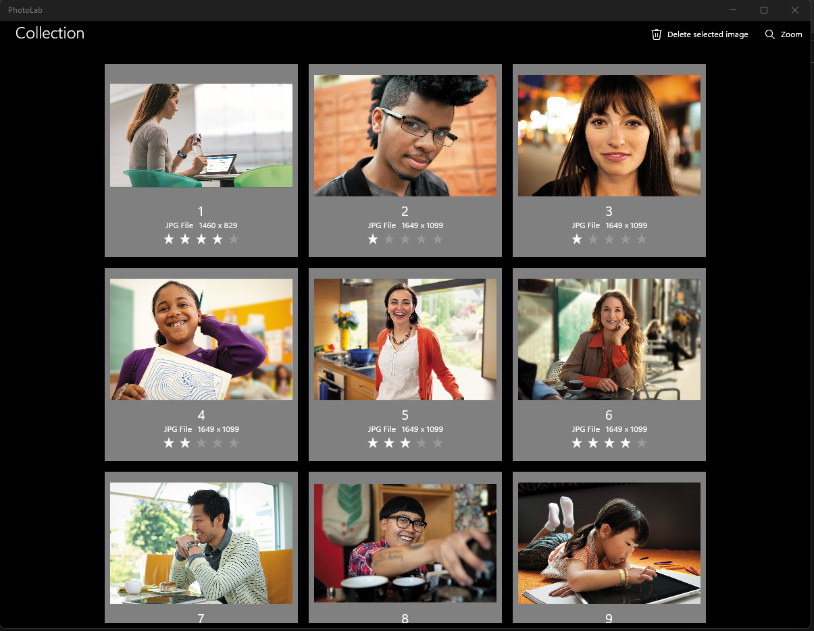
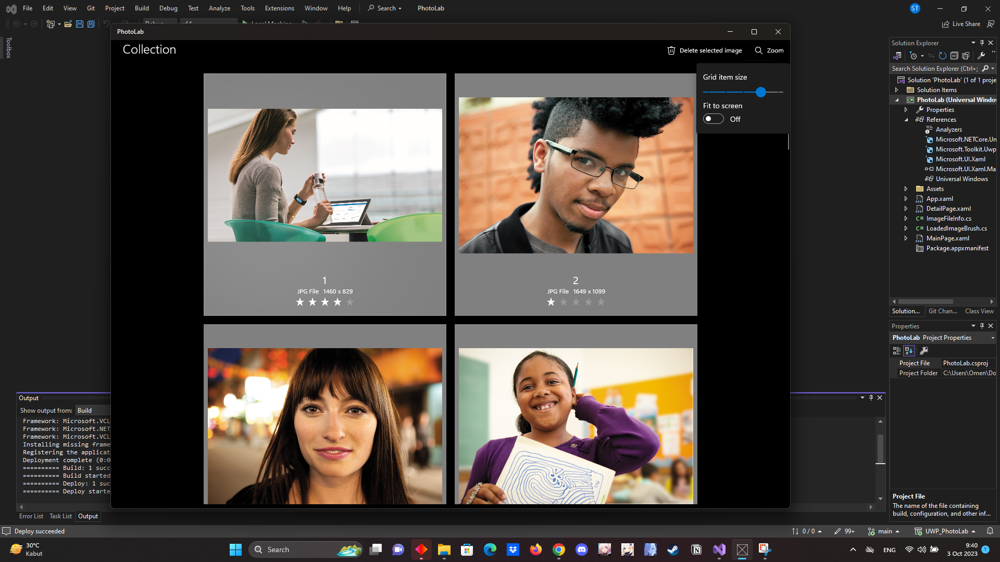

# UWP_PhotoLab
Make a PhotoLab App using UWP in C# Language to complete PBKK task

## Nama : Sandyatama Fransisna Nugraha
## NRP: 5025211196
## Kelas : PBKK B
## Tahun : 2023

 

## Ini adalah tugas kelima untuk melakukan pembuatan aplikasi photo lab  dari mata kuliah Pemrogaman Berbasis Kerangka Kerja untuk mempratekkan penggunaan UWP dengan menggunakan bahasa C#. 

## Aplikasi ini yang dibuat adalah aplikasi sederhana yang berisikan tampilan visual gambar dalam windows.

### 1. Hasil Program

### 2. Fitur Mengubal Tampilan Visual

